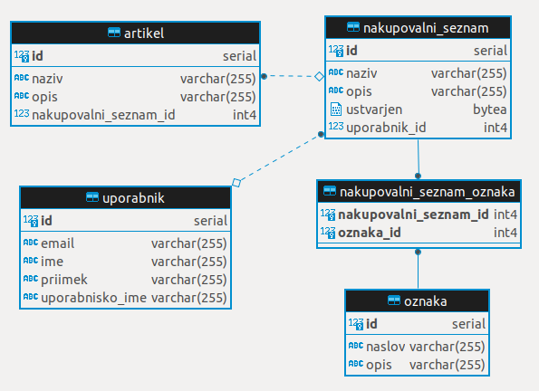

# kumuluzee-learning-jpa
### About the project
Trying [KumuluzEE](https://ee.kumuluz.com/) framework for building cloud native microservices in Java.  
Learning Java CDI Beans, Servlets, Maven, Hibernate, REST.

### Create a PostgreSQL database in Docker
``` bash
# get the container and create it
sudo docker run -d --name postgres-jpa -e POSTGRES_PASSWORD=postgres -e POSTGRES_DB=nakupovalniseznami -p 5432:5432 postgres:13

# rerun
sudo docker start postgres-jpa
```

### Run microservice
Add <b>com.kumuluz.ee.EeApplication</b> as main class and choose module <b>api</b> as main module in IntelliJ configuration to start the microservice.  
Check [http://localhost:8080/servlet](http://localhost:8080/servlet)

### Data model
\
